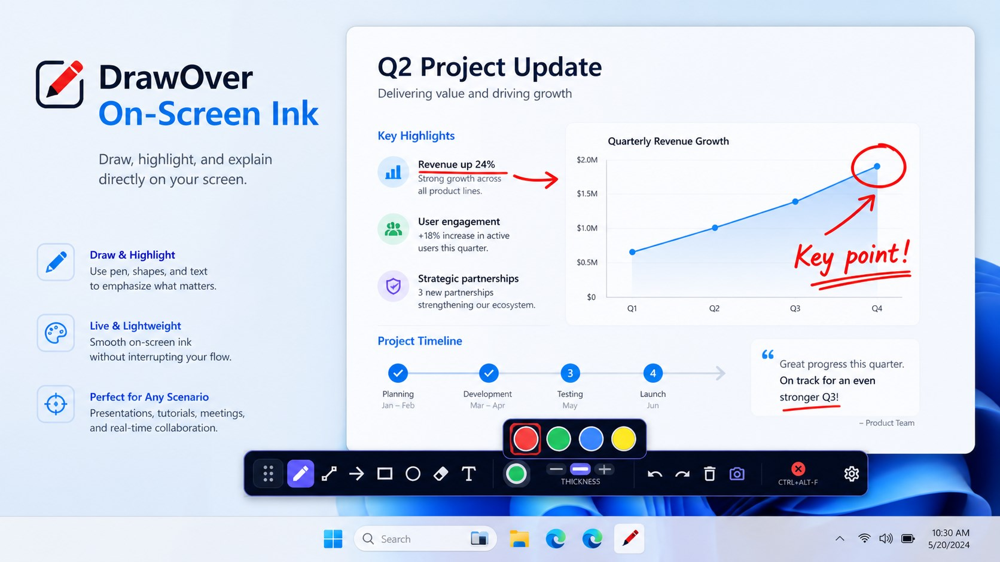

# DrawOver — On-Screen Ink for Windows

<p align="center">
  
</p>

<p align="center">
  <strong>Draw, highlight, and explain directly over your Windows screen.</strong>
</p>

<p align="center">
  <a href="#download">Download</a> ·
  <a href="#features">Features</a> ·
  <a href="#use-cases">Use Cases</a> ·
  <a href="#whats-new">What's New</a> ·
  <a href="#privacy">Privacy</a> ·
  <a href="#support">Support</a>
</p>

---

## Overview

**DrawOver** is a lightweight screen annotation tool for Windows that lets you draw, highlight, and annotate directly over your desktop, apps, presentations, meetings, and screen shares.

Press a keyboard shortcut to activate the transparent overlay, sketch your idea, then dismiss it just as quickly.

No heavy apps to launch.  
No switching windows.  
No subscriptions.  
No account required.  
No internet required.

DrawOver is designed for people who need quick visual explanations without interrupting their workflow.

---

## Download

DrawOver is available on the Microsoft Store.

<a href="https://get.microsoft.com/installer/download/9mx1k4qn2ngn?referrer=appbadge" target="_self" >
	
</a>

---

## Features

| Feature | Description |
|---|---|
| Freehand drawing | Draw directly over your full Windows desktop |
| Shapes | Add rectangles, ellipses, lines, and arrows |
| Text annotations | Click anywhere on screen and type |
| Eraser | Remove individual strokes precisely |
| Undo / Redo | Use `Ctrl + Z` and `Ctrl + Y` |
| Screenshot capture | Save annotated screenshots as PNG |
| Save / Load | Save drawing sessions in ISF format |
| Ink colors | Choose from red, green, blue, and yellow |
| Stroke thickness | Switch between thin, medium, and thick strokes |
| Floating toolbar | Compact draggable toolbar that stays out of the way |
| Custom shortcut | Toggle the overlay with your preferred hotkey |
| First-run tutorial | Learn the basics in seconds |

---

## Use Cases

DrawOver is useful for:

- Presentations and live demos
- Online meetings and screen shares
- Teaching and training sessions
- UI/UX reviews
- Bug reports and support calls
- Pair programming
- Design feedback
- Quick visual explanations
- Annotating documents, dashboards, and existing apps

---

## Why DrawOver?

### Instant on/off

Toggle the overlay with a keyboard shortcut and continue working without breaking your flow.

### Lightweight by design

DrawOver focuses on fast annotation instead of becoming a full drawing suite.

### Works over everything

Use it over apps, windows, presentations, browsers, dashboards, meetings, and your full desktop.

### Built for practical communication

Sometimes a quick circle, arrow, or note explains more than a long message.

---

## Keyboard Shortcut

Default overlay toggle:

```text
Ctrl + Alt + D
```

You can change the shortcut from the app settings.

---

## What's New

### Initial Release

This first release includes:

- Freehand pen drawing over the entire screen
- Rectangle, ellipse, line, and arrow tools
- Text annotations
- Stroke eraser
- Undo and redo
- Save drawings
- Screenshot capture
- Customizable toggle hotkey
- Red, green, blue, and yellow ink colors
- Thin, medium, and thick stroke widths
- Compact draggable toolbar
- Settings from the system tray
- First-run tutorial for new users

---

## System Requirements

| Requirement | Value |
|---|---|
| Platform | PC |
| Operating system | Windows 10 version 19041.0 or higher |
| Internet | Not required |
| Account | Not required |

---

## Privacy

DrawOver is designed to work locally on your device.

- No account required
- No subscription required
- No internet connection required for core features
- No background screen recording
- No cloud sync

See [`PRIVACY.md`](PRIVACY.md) for more details.

---

## Support

Found a bug, have feedback, or need help?

Please open an issue in this repository or contact support:

```text
support@example.com
```

When reporting an issue, please include:

- Windows version
- App version
- Steps to reproduce the issue
- Screenshot or short explanation, if possible

---

## Roadmap

Potential future improvements:

- More annotation colors
- More shape styles
- Numbered markers
- Spotlight / focus mode
- Export options
- Improved multi-monitor behavior
- More toolbar customization

---

## Repository Notice

This repository is the official product information, changelog, support, and release notes page for DrawOver.

The DrawOver application source code is not public.

---

## License

This repository is provided for product information, support, and release notes only.

The DrawOver application source code is closed-source, and no license is granted to copy, modify, redistribute, or reverse engineer the application.
